# CRUD PERSONA CON SPRINT BOOT
Este proyecto es la continuación de la creación de un crud de persona en la cual se implentaron los 
metodos faltantes como PUT,DELETE,UPDATE Y GET POR ID.
## Comenzando 🚀

_Para poder descargar el codigo y ejecutarlo necesita lo siguiente:_

### Pre-requisitos 📋

_Sofware y otras herramientas utilizadas_

```
IntelliG IDEA
JAVA 11
MAVEN
POSTMAN
MYSQL
XAMP
```
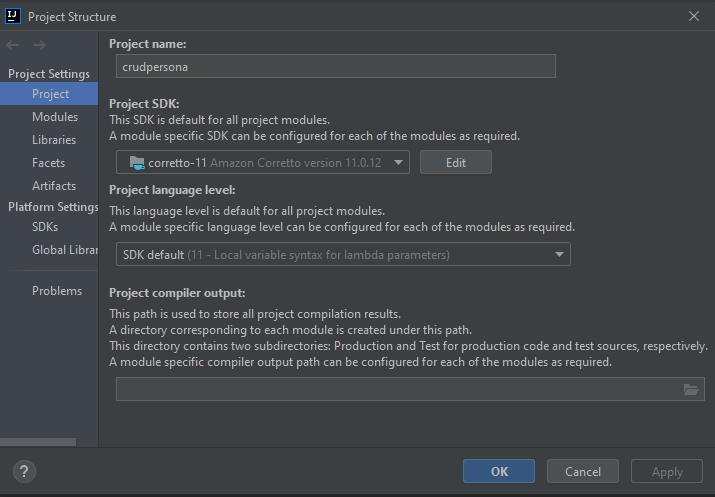

### Creacion de base de datos
Para que funcione se necesita crear un gestor de base de datos en 
este caso se utilizo Mysql con la ayuda de Xamp:(se debe correr como se muestra en el XAMP antes correr la api sino tendra un error)
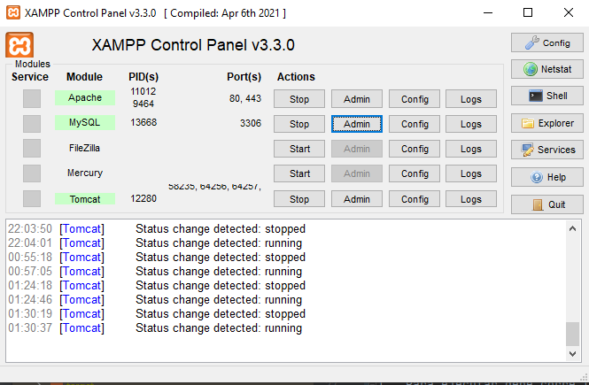
creacion de base de datos:
La base de datos se llamara:
```
db_persona
```
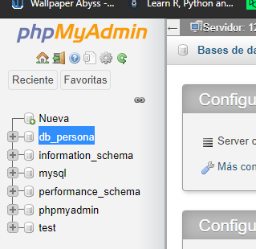
### Ejecucion 🔧

1. _Para ejecutar debe corre la clase CrudpersonaApplication_
   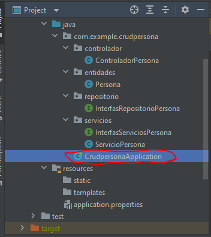

2. _Al terminar la ejecucion te dara el puerto en el que corre_
   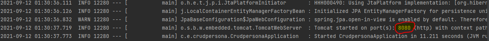
3. Lo que significa que nuestra api correra en esta direccion:(en caso de ser otra cambiar el puerto del localhost al que indica)
   ```
   http://localhost:8080/
   ```
4. Para probar la api abriremos POSTMAN
* POST
   - Request:
   ```
   http://localhost:8080/api/guardarPersona/
   ```
  ```
  {
    "nombre":"Yhomira",
    "edad":"25"
  }
  ```
  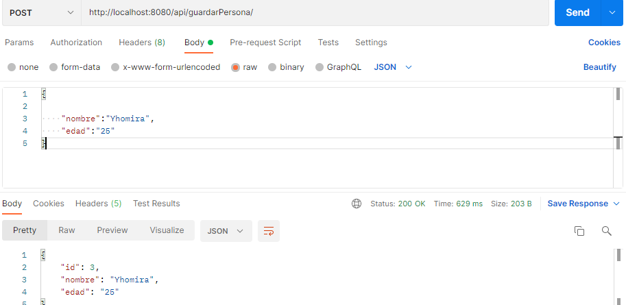
* GET
- Request:
   ```
   http://localhost:8080/api/listarPersonas/
   ```
  
* GET POR ID
- Request:
   ```
   http://localhost:8080/api/listarPersonas/[id]
   ```
  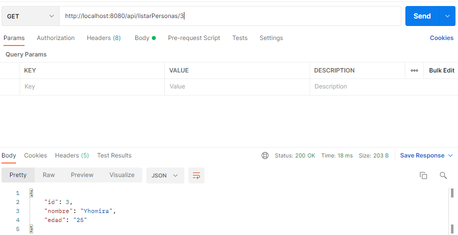
* PUT
- Request:
   ```
   http://localhost:8080/api/actualizar
   ```
   ```
   {
    "id":"3",
    "nombre":"Yhomra Alexandra Yupayccana",
    "edad":"25"
  }
   ```
  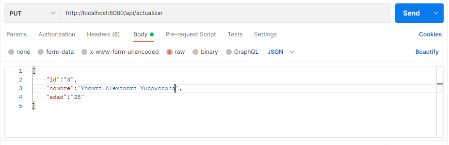
  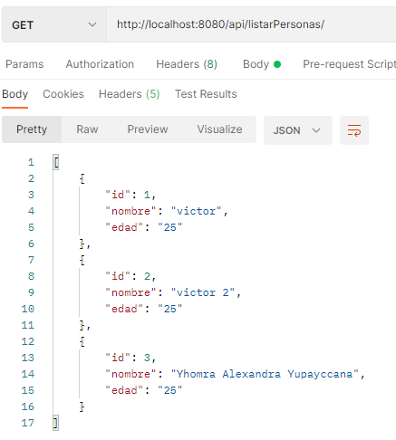
* DELETE
- Request:
   ```
   http://localhost:8080/api/eliminarPersona/3
   ```
   
  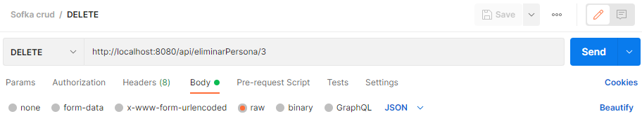
  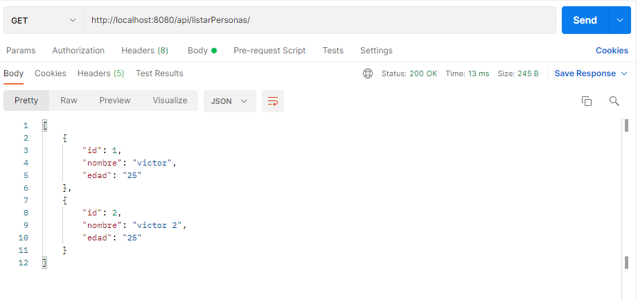
## RESULTADOS
Se pudo desarrollar todos los metodos del crud pedidos
espero que haya sido de su agrado️

---
⌨️ con ❤️ por [yhomira](https://github.com/arimohy) 😊